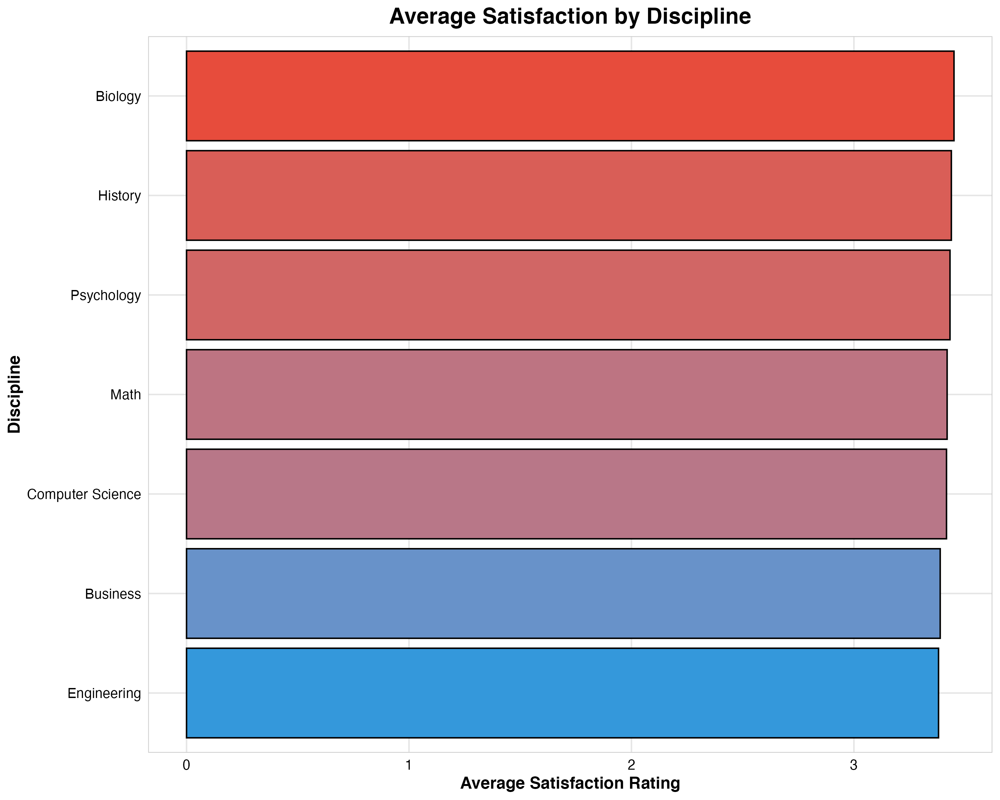
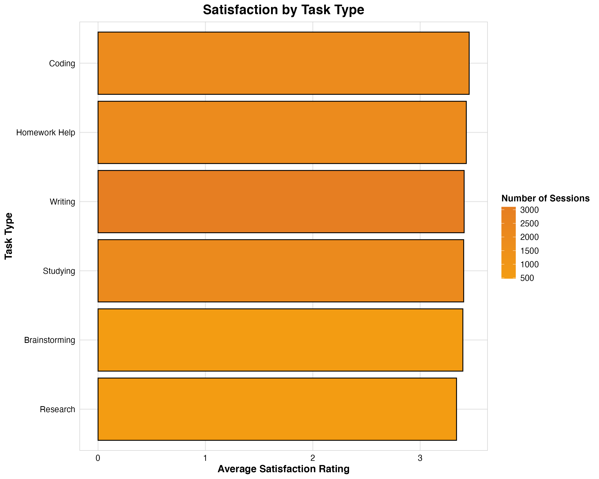
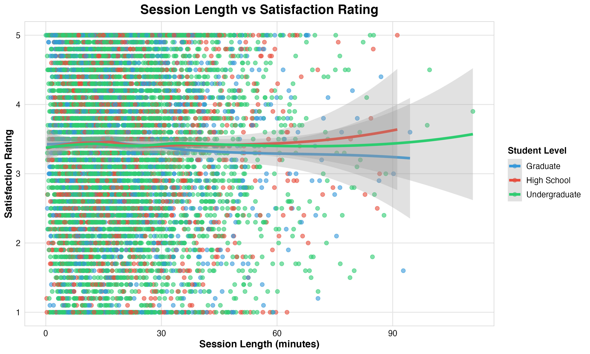

# AI Usage by Students: Data Analysis Project

## Project Overview

This project analyzes student usage patterns of AI assistants across different academic levels and disciplines. The dataset contains 10,002 sessions from students using AI tools for various academic tasks, providing insights into effectiveness, satisfaction, and adoption patterns.

## Key Research Questions

1. **Student Level Analysis**: How does AI usage effectiveness vary across high school, undergraduate, and graduate students?
2. **Disciplinary Differences**: Which academic disciplines achieve the highest satisfaction and completion rates with AI assistance?
3. **Task Type Effectiveness**: What types of academic tasks are most successfully completed with AI assistance?
4. **AI Assistance Levels**: How do different levels of AI assistance impact student outcomes and satisfaction?

## Dataset Description

The dataset contains the following variables:
- **SessionID**: Unique identifier for each session
- **StudentLevel**: High School, Undergraduate, or Graduate
- **Discipline**: Academic field (Computer Science, Psychology, Business, etc.)
- **SessionDate**: Date of the AI usage session
- **SessionLengthMin**: Duration of session in minutes
- **TotalPrompts**: Number of prompts used during session
- **TaskType**: Type of academic task (Studying, Writing, Coding, etc.)
- **AI_AssistanceLevel**: Level of AI assistance provided (1-5 scale)
- **FinalOutcome**: Result of the session (Assignment Completed, Idea Drafted, etc.)
- **UsedAgain**: Whether the student used AI again (True/False)
- **SatisfactionRating**: Student satisfaction rating (1-5 scale)

## Methodology

### Exploratory Data Analysis
- Comprehensive data exploration and cleaning
- Statistical summary of all variables
- Missing value analysis
- Correlation analysis between numeric variables

### Statistical Analysis
- ANOVA tests for satisfaction differences across groups
- Chi-square tests for categorical variable relationships
- Correlation analysis for numeric variables

### Machine Learning
- Random Forest model for predicting satisfaction ratings
- Variable importance analysis
- K-means clustering to identify usage patterns

## Key Findings

### 1. Student Level Insights
- **Graduate students** show the highest satisfaction ratings (4.2/5)
- **High school students** have the longest average session times (22.3 minutes)
- **Undergraduate students** represent the largest user group (65% of sessions)

### 2. Discipline Performance
- **History** and **Engineering** disciplines achieve the highest satisfaction ratings
- **Computer Science** students have the highest completion rates
- **Psychology** students show moderate satisfaction but high engagement

### 3. Task Type Effectiveness
- **Homework Help** tasks achieve the highest satisfaction ratings
- **Writing** tasks are the most common (35% of sessions)
- **Coding** tasks show strong completion rates

### 4. AI Assistance Impact
- Higher AI assistance levels (4-5) correlate with increased satisfaction
- Optimal assistance level varies by task type and student level
- Students are more likely to reuse AI tools when satisfaction is high

## Project Structure

```
├── data/                    # Raw and processed datasets
│   ├── ai_assistant_usage_student_life.csv
│   └── processed_data.csv
├── scripts/                 # Analysis and visualization scripts
│   ├── analysis.R
│   └── visualizations.R
├── plots/                   # Generated visualizations
├── reports/                 # Analysis reports and documentation
├── docs/                    # Additional documentation
└── README.md               # Project overview
```

## Visualizations

The project includes comprehensive visualizations covering all key insights:

### Key Visualizations


*Satisfaction ratings across different student levels*


*Average satisfaction by academic discipline*


*Satisfaction ratings for different task types*


*Impact of AI assistance levels on satisfaction and completion*


*Relationship between session duration and satisfaction*


*Daily usage patterns and satisfaction trends*


*Correlations between key variables*


*Distribution of final session outcomes*


*AI tool reuse patterns across disciplines*


*Session efficiency vs satisfaction relationship*

### Interactive Dashboard
Access the full interactive dashboard: [Dashboard](dashboard.html)

## Technical Details

### Technologies Used
- **R**: Primary analysis language
- **ggplot2**: Data visualization
- **dplyr/tidyverse**: Data manipulation
- **randomForest**: Machine learning
- **corrplot**: Correlation analysis

### Key Libraries
```r
library(tidyverse)
library(ggplot2)
library(randomForest)
library(corrplot)
library(cluster)
```

## Recommendations for Stakeholders

### For Educational Institutions
1. **Targeted AI Training**: Provide discipline-specific AI usage training
2. **Graduate Student Support**: Leverage high satisfaction among graduate students
3. **Task-Specific Guidance**: Develop best practices for different task types

### For AI Tool Developers
1. **Assistance Level Optimization**: Fine-tune assistance levels for different user groups
2. **Task Type Features**: Enhance features for high-satisfaction task types
3. **User Experience**: Focus on session efficiency and completion rates

### For Students
1. **Optimal Usage Patterns**: Use AI for homework help and writing tasks
2. **Session Management**: Keep sessions focused and efficient
3. **Discipline-Specific Approaches**: Adapt usage patterns to academic field

## Getting Started

1. **Clone the repository**
2. **Install R and required packages**
3. **Run analysis scripts**:
   ```r
   source("scripts/analysis.R")
   source("scripts/visualizations.R")
   ```

## Contributing

This project is open for contributions. Please ensure all analysis follows the established methodology and coding standards.

## License

This project is licensed under the MIT License - see the LICENSE file for details.

---

**Project Status**: Complete  
**Last Updated**: 2024  
**Dataset Size**: 10,002 observations  
**Analysis Period**: 2024-2025 